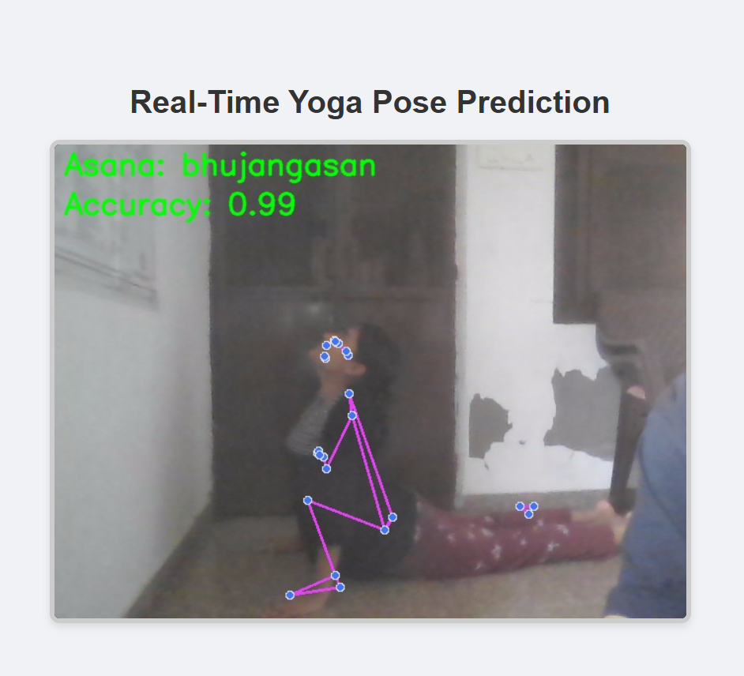
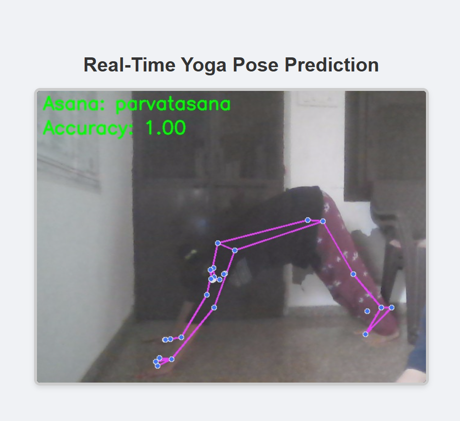
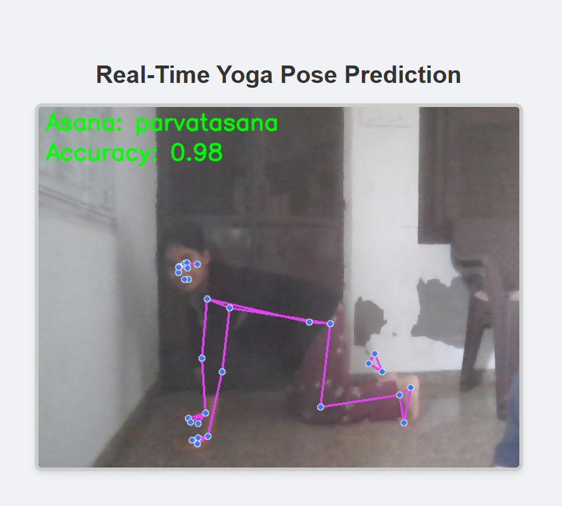

# Real-Time Yoga Pose Detector

This project is an AI-powered yoga trainer that uses your webcam to identify which yoga asana you are performing in real-time. It provides immediate feedback on the name of the pose and a confidence score for the prediction.




---

## 📋 Features

- **Real-Time Pose Recognition**: Identifies 6 different yoga asanas using a live webcam feed.
- **Data Augmentation**: Includes scripts to expand a small video dataset to improve model robustness.
- **Keypoint Detection**: Utilizes MediaPipe to extract 33 body landmarks for accurate pose analysis.
- **Sequence Modeling**: Employs an LSTM (Long Short-Term Memory) neural network to understand the temporal nature of yoga poses.
- **Live Feedback**: Overlays the predicted asana and an accuracy/confidence score directly onto the video stream.
- **Web-Based UI**: A simple and clean user interface built with Flask.

---

## 🛠️ Technology Stack

- **Backend**: Python
- **Deep Learning**: TensorFlow, Keras
- **Pose Estimation**: Google's MediaPipe
- **Computer Vision**: OpenCV
- **Web Framework**: Flask
- **Data Handling**: Pandas, NumPy, Scikit-learn

---

## 📂 Folder Structure

```
yoga_pose_project/
|
|-- app/
|   |-- templates/
|       |-- index.html
|   |-- main.py
|
|-- data/
|   |-- augmented_videos/
|   |-- processed_keypoints/
|   |   |-- keypoints_data.csv
|   |   -- labels.csv |   -- raw_videos/
|       |-- Trikonasana/
|       |   |-- avg/
|       |   |-- good/
|       |   -- poor/ |       -- ...
|
|-- models/
|   |-- label_encoder.pkl
|   -- yoga_pose_model.keras 
|-- src/ 
    |-- 01_data_augmentation.py 
    |-- 02_data_preprocessing.py 
    |-- 03_train_model.py
|
|-- README.md
|-- requirements.txt

```
---
Download the dataset from kaggle or prepare it by yourself.
---

## 🚀 Setup and Installation

1.  **Clone the Repository**
    ```bash
    git clone https://github.com/vedikasharma2801/Yoga-Pose-Detector.git
    cd Yoga-Pose-Detector
    ```

2.  **Create a Virtual Environment** (Recommended)
    ```bash
    python -m venv venv
    # On Windows
    .\venv\Scripts\activate
    # On macOS/Linux
    source venv/bin/activate
    ```

3.  **Install Dependencies**
    Create a `requirements.txt` file with the following content:
    ```
    tensorflow
    opencv-python
    mediapipe
    scikit-learn
    pandas
    Flask
    ```
    Then, run the installation command:
    ```bash
    pip install -r requirements.txt
    ```

---

## 🏃‍♀️ How to Use the Project

Follow these steps in order to train the model on your own data and run the application.

### Step 1: Add Your Raw Video Data

-   Navigate to the `data/raw_videos/` directory.
-   For each asana, create a folder with its name (e.g., `Trikonasana`).
-   Inside each asana folder, create three sub-folders: `avg`, `good`, and `poor`.
-   Place your recorded videos (`.mp4`, `.avi`) into the corresponding rating folder.

### Step 2: Augment Your Dataset

-   To increase the size of your dataset, run the data augmentation script. This will create modified versions of your videos (flipped, rotated, etc.).
    ```bash
    python ./src/01_data_augmentation.py
    ```

### Step 3: Preprocess Data and Train the Model

1.  **Extract Keypoints**: This script uses MediaPipe to analyze all videos in `data/augmented_videos/` and extracts body landmarks, saving them into CSV files.
    ```bash
    python ./src/02_data_preprocessing.py
    ```

2.  **Train the Model**: This script loads the processed keypoints, builds an LSTM model, and trains it to classify the asanas. The trained model (`.keras`) and a label encoder (`.pkl`) will be saved in the `models/` directory.
    ```bash
    python ./src/03_train_model.py
    ```

### Step 4: Run the Real-Time Application

-   Once the model is trained and saved, start the Flask web application.
    ```bash
    python ./app/main.py
    ```
-   Open your web browser and navigate to **`http://127.0.0.1:5000`**.
-   Allow the browser to access your webcam if prompted. You will see the live feed with real-time pose predictions.

---

## 💡 How It Works

The application pipeline is as follows:

1.  **Video Capture**: Flask and OpenCV capture frames from the webcam.
2.  **Keypoint Extraction**: Each frame is passed to MediaPipe Pose, which returns the 3D coordinates of 33 body landmarks.
3.  **Data Normalization**: The keypoints are flattened into a 1D array.
4.  **Prediction**: This array is fed into the pre-trained LSTM model, which outputs a probability score for each asana.
5.  **Feedback Display**: The asana with the highest probability is chosen as the prediction. The result is displayed on the video frame, which is then streamed to the web interface.

